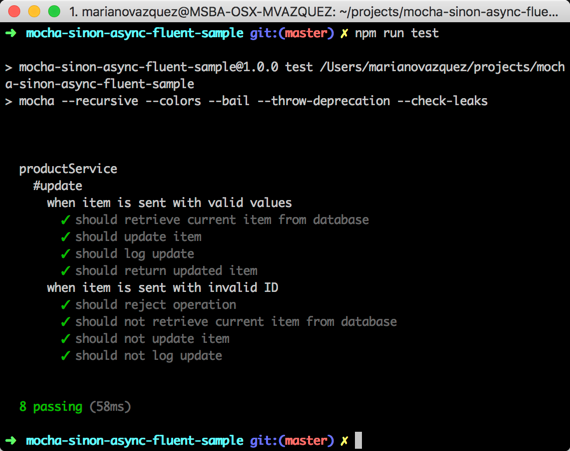

## Mocha sinon async fluent tests sample

A sample app with some examples on how to test promises and asynchronous code in JS using a fluent syntax.

### Installation and usage

```
git clone git@github.com:nanovazquez/mocha-sinon-async-fluent-sample.git
cd mocha-sinon-async-fluent-sample
npm install

npm run test
```



> **Note:** To debug the tests, simply run `npm run test-debug` and attach a debugger to the port specified.
